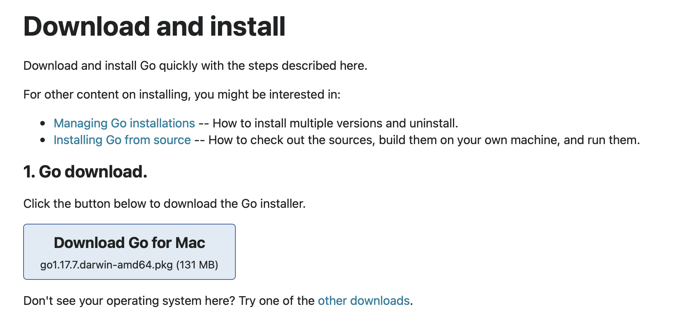
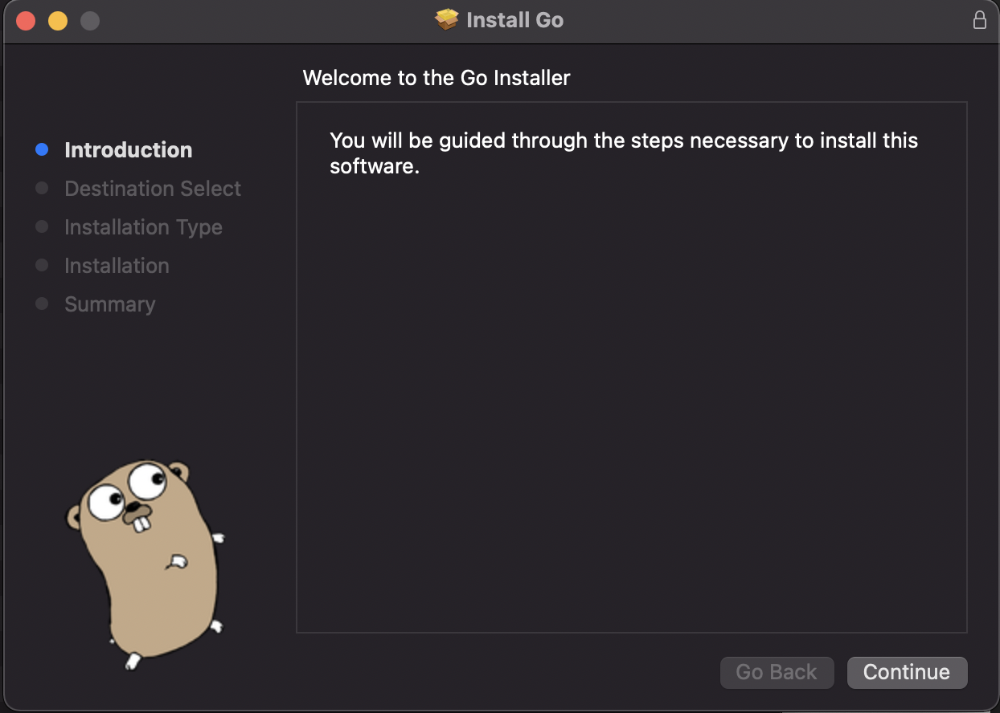
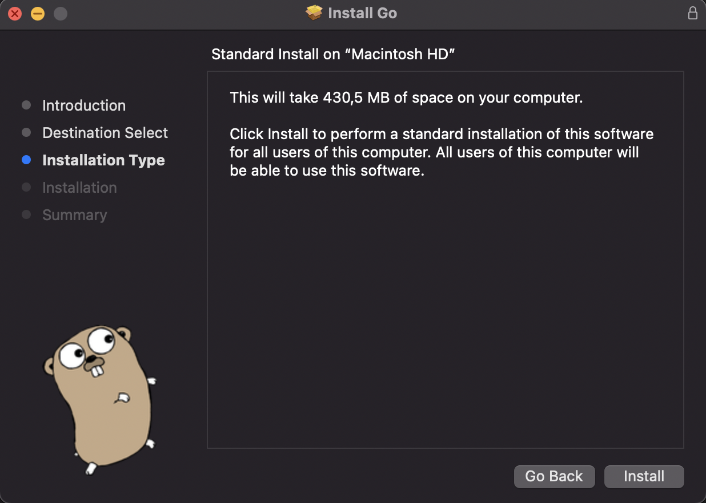
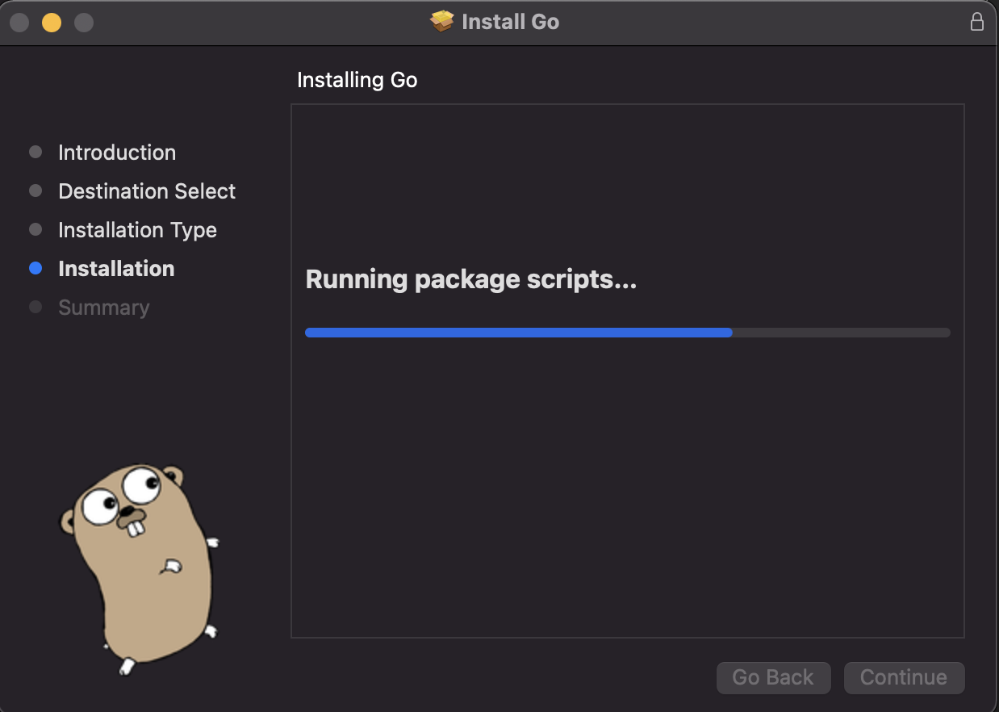
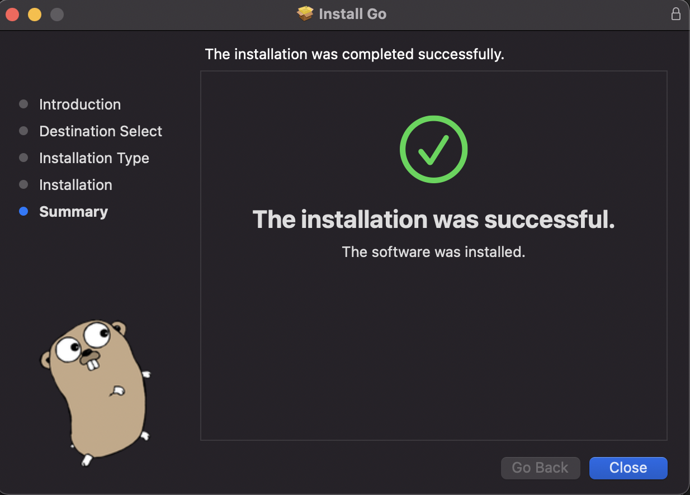
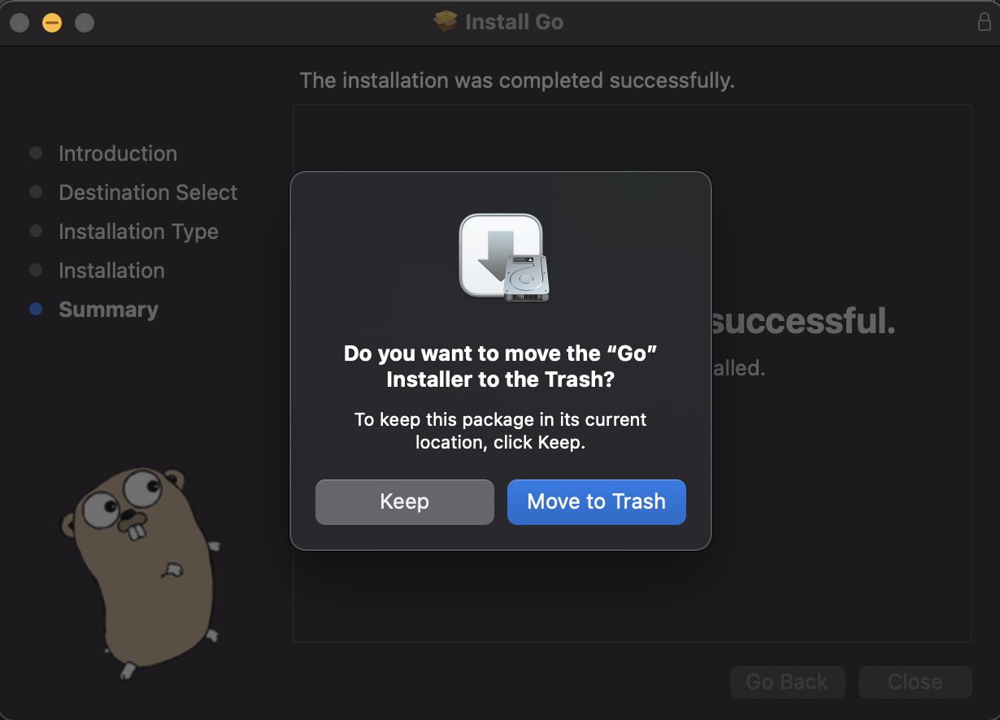
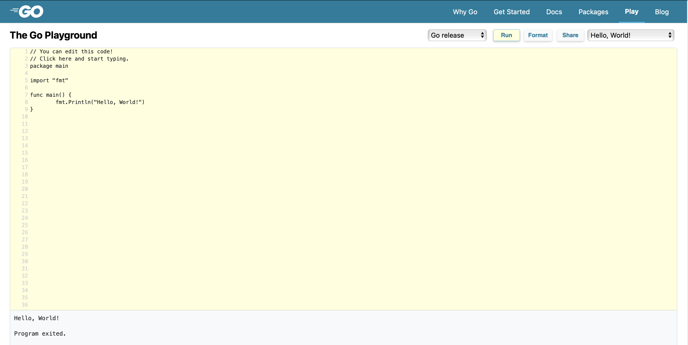

# 0. Getting Started with Go

- [0. Getting Started with Go](#0-getting-started-with-go)
  - [1. Installation](#1-installation)
    - [1.1 Download the Go package for MacOS](#11-download-the-go-package-for-macos)
    - [1.2 Follow the Go Installer](#12-follow-the-go-installer)
    - [1.3 Verify that your system recognizes Go](#13-verify-that-your-system-recognizes-go)
  - [2. ```"Hello, World!"```](#2-hello-world)
    - [2.1 The Go Playground](#21-the-go-playground)
    - [2.2 Run "Hello, World!" Program with an IDE](#22-run-hello-world-program-with-an-ide)
  - [3. Uninstall Go](#3-uninstall-go)
  - [4. More resources to learn Go](#4-more-resources-to-learn-go)
  - [References](#references)

## 1. Installation
In this tutorial, I will demonstrate the process to install Go in MacOS (which pretty much follows the Go's official installation instructions [\[1\]][1]). Processes for other operating systems are similar.

### 1.1 Download the Go package for MacOS

You can visit the [Downloads and install][1] site to get a suggested package that the Go developers think suitable for your operating system. Or you can choose for yourself from an exhausted list of packages from the [Downloads](https://go.dev/dl/) page. I will use the former approach.

 

Click on the `Download Go for Mac` button and wait for the download to complete.

### 1.2 Follow the Go Installer
After that, follow the installation wizard to complete the installation (I trust the Go developers so will click Next - Next - ...)

**On the installation prompt starter - Click Continue.**



**Then, click Install**



**Next, wait for a few minutes for the Go Installer to write some files.**



**Most of the time, if you (and your computer) have a good day, the installation will be successful after a few minutes. Click Close to complete the installation.**



**You can move the Installer to Trash to save storage space.**



### 1.3 Verify that your system recognizes Go
Open your **Terminal** and type in the command prompt 
```bash
go version
```

If it returns a short line of version such as the example below then congratulations, you are good to go with Go!
```bash
go version go1.17.7 darwin/amd64
```

If it does not work, you may need to restart your **Terminal** so that it recognizes the newly added ```go``` command in *PATH*.

## 2. ```"Hello, World!"```
There are two ways that you can get your hands on with the "Hello, World!" program in Go.
### 2.1 The Go Playground
You can visit [The Go Playground](https://go.dev/play/) (an online web-based environment designed specifically for Go-implementation) and run the default program by clicking the **Run** button, it will display the "Hello, World!" program.



### 2.2 Run "Hello, World!" Program with an IDE

In this tutorial, I will instruct you to use Go with Visual Studio Code (VSCode). This is a matter of interest, you can write the program in whatever IDE you prefer.

First, to have the best experience with the language in VSCode, you should install Go-extension for VSCode. Go to **Extentions** > **Go** (choose [this version](https://marketplace.visualstudio.com/items?itemName=golang.go) developed by the Go's developer team at Google). If you install correctly, the following file will have color marker for Go keywords as below.

Create a file named ```hello.go``` with the code below.

**Note**: You can find the sample code of this book in the **code** folder, followed by chapter name.

```go
package main

import "fmt"

func main() {
	fmt.Println("Hello, World!")
}
```

To execute this file, go to **Terminal** and move to the folder that contains the ```hello.go``` file (if you are not familiar with **Terminal**, it means type in ```cd folder/folder/.../folder```, replace the folder with your directory). Then, run ```go run hello.go```

```bash
# example in my laptop
cd Desktop/Panda1835/Go-for-Beginner/code/00-getting-started
go run hello.go

>>> Hello, World!
```

If you receive the "Hello, World!" then *Voila!*, you have successfully run your very first program in Go!

## 3. Uninstall Go
The uninstallation is followed from the Go's official documentation [\[2\]][2].

Delete the go directory:  
```sudo rm -rf /usr/local/go```

Remove the Go bin directory from your PATH environment variable.   
```sudo rm /etc/paths.d/go```

## 4. More resources to learn Go
I suggest several resources here to learn more about Go.

Website:
1. [A tour of Go](https://go.dev/tour/list)
2. [The Go website: Learning resources](https://go.dev/learn/)
3. [The Go Programming Language Report](https://kuree.gitbooks.io/the-go-programming-language-report/content/)

Books:
1. [Go in Action by William Kennedy, Brian Ketelsen, and Erik St. Martin](https://www.amazon.com/Go-Action-William-Kennedy/dp/1617291781)


## References
1. [The Go website: Download and install][1]
2. [The Go website: Managing Go installations][2]

[1]: https://go.dev/doc/install
[2]: https://go.dev/doc/manage-install#uninstalling